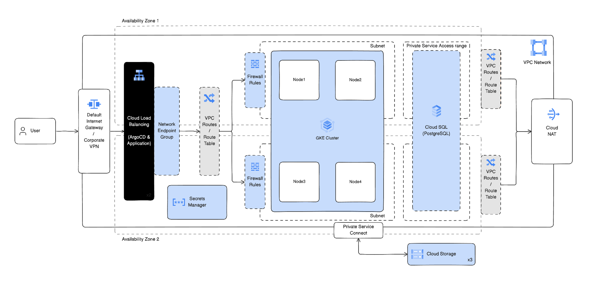

# Confident AI on GCP: Terraform

Terraform module that stands up the cloud infrastructure for a self-hosted [Confident AI](https://confident-ai.com) deployment on Google Cloud, ready for the `confident-ai` Helm chart. It creates a GKE cluster, a Cloud SQL PostgreSQL database, GCS buckets, and the IAM plumbing the app needs, using **GKE Workload Identity**, so there are no service-account keys.

> Registry: `confident-ai/confident-ai/google` · deploys into an **existing VPC network** (it never creates one).

## Architecture



Into a VPC network and subnet you already have, this module provisions:

- **GKE**: a regional, private cluster with a node pool and Workload Identity enabled.
- **Cloud SQL for PostgreSQL**: private IP, the app's primary database.
- **Cloud Storage**: two GCS buckets (test cases + payloads).
- **App identity**: a Google service account bound to the app's Kubernetes ServiceAccount through **Workload Identity** (keyless).
- **Code executor** _(optional, on by default)_: a Cloud Functions (gen2) sandbox for code-based metrics.
- **Secret Manager** _(optional)_: a secret + a Workload-Identity-bound service account for the External Secrets Operator.
- **Memorystore for Redis** _(optional)_: managed Redis instead of the in-cluster one.

ClickHouse and Redis run inside the cluster by default (the Helm chart installs them). Cluster add-ons (ingress controller, cert-manager, External Secrets Operator) are environment choices and are **not** installed here, the module builds infrastructure only; the Helm chart deploys the application.

## Prerequisites

- `terraform` ≥ 1.5, the `gcloud` CLI (+ `gke-gcloud-auth-plugin`), `kubectl`, and `helm` ≥ 3.8.
- `gcloud auth application-default login`, and these APIs enabled: `container`, `sqladmin`, `servicenetworking`, `compute`.
- An **existing VPC network** with a subnet that has **two secondary ranges** (pods + services) and Cloud NAT for the private nodes. Need to create one? See [the self-hosting guide](https://www.confident-ai.com/docs/self-hosting/gcp).

## Usage

```hcl
provider "google" {
  project = "my-gcp-project"
  region  = "us-central1"
}

module "confident_ai" {
  source  = "confident-ai/confident-ai/google"
  version = "~> 0.1"

  confident_gcp_project_id = "my-gcp-project"
  confident_gcp_region     = "us-central1"

  # your existing network
  confident_network_name      = "confident-prod-vpc"
  confident_network_id        = "projects/my-gcp-project/global/networks/confident-prod-vpc"
  confident_subnetwork_name   = "confident-prod-subnet"
  confident_ip_range_pods     = "confident-pods"
  confident_ip_range_services = "confident-services"

  # prod naming convention
  confident_environment      = "prod"
  confident_environment_code = "p"

  confident_public_gke = true   # reach the API from your machine (false = private-only)
}
```

```bash
terraform init
terraform apply
eval "$(terraform output -raw configure_kubectl)"   # point kubectl at the new cluster
```

For a complete minimal config see [`examples/quickstart.tf`](./examples/quickstart.tf); for an end-to-end walkthrough that also creates the network and installs the chart, see [the self-hosting guide](https://www.confident-ai.com/docs/self-hosting/gcp).

## Deploying the application

This module is infrastructure only. Install the app with the `confident-ai` Helm chart, wiring these outputs into its values:

| Terraform output                        | Helm value                                                     |
| --------------------------------------- | -------------------------------------------------------------- |
| `database_url` (sensitive)              | `secrets.data.DATABASE_URL`                                    |
| `test_cases_bucket` / `payloads_bucket` | `storage.testCasesBucket` / `storage.payloadsBucket`           |
| `app_service_account_email`             | `serviceAccount.annotations["iam.gke.io/gcp-service-account"]` |
| `code_executor_function_name`           | `codeExecutor.gcp.functionName`                                |
| `secret_manager_secret_id`              | `secrets.externalSecrets.remoteKey`                            |
| `redis_url`                             | `redis.externalUrl`                                            |

`terraform output helm_values` prints a ready-to-paste values snippet. Full walkthrough (secrets, ingress, managed Redis, code executor): [the self-hosting guide](https://www.confident-ai.com/docs/self-hosting/gcp).

## Inputs

**Required**

| Name                                                      | Description                              |
| --------------------------------------------------------- | ---------------------------------------- |
| `confident_gcp_project_id`                                | GCP project to deploy into.              |
| `confident_network_name` / `confident_network_id`         | Existing VPC network name and self-link. |
| `confident_subnetwork_name`                               | Existing subnet for GKE nodes.           |
| `confident_ip_range_pods` / `confident_ip_range_services` | Existing secondary range names.          |

**Commonly set** (all optional, with sensible prod defaults)

| Name                                                                | Default               | Description                                                                  |
| ------------------------------------------------------------------- | --------------------- | ---------------------------------------------------------------------------- |
| `confident_gcp_region`                                              | `us-central1`         | Region for the regional cluster + data plane.                                |
| `confident_environment` / `confident_environment_code`              | `stage` / `s`         | Environment name used in resource naming (use `prod` / `p`).                 |
| `confident_public_gke`                                              | `false`               | Expose the GKE public endpoint (needed for kubectl/helm from your laptop).   |
| `confident_node_machine_type` / `confident_node_group_desired_size` | `n2-standard-8` / `4` | Node pool sizing.                                                            |
| `confident_code_executor_enabled` / `confident_ar_repository_name`  | `true` / `""`         | Code-executor Cloud Function (Artifact Registry repo required when enabled). |
| `confident_create_secret_manager`                                   | `false`               | Secret + ESO Workload Identity.                                              |
| `confident_managed_redis_enabled`                                   | `false`               | Provision Memorystore instead of in-cluster Redis.                           |

See [`variables.tf`](./variables.tf) for the complete list (naming, Cloud SQL sizing, backups, tags, …).

## Outputs

| Name                                                                 | Description                                                          |
| -------------------------------------------------------------------- | -------------------------------------------------------------------- |
| `configure_kubectl`                                                  | `gcloud container clusters get-credentials …` command.               |
| `cluster_name`                                                       | GKE cluster name.                                                    |
| `database_url` _(sensitive)_                                         | PostgreSQL connection string for the Helm chart.                     |
| `test_cases_bucket` / `payloads_bucket` / `clickhouse_backup_bucket` | GCS bucket names.                                                    |
| `app_service_account_email`                                          | GSA email for the Workload Identity annotation.                      |
| `eso_service_account_email`                                          | GSA for the ESO ServiceAccount (null unless Secret Manager enabled). |
| `code_executor_function_name`                                        | Cloud Function name (null when disabled).                            |
| `secret_manager_secret_id`                                           | Secret id for ESO (null unless enabled).                             |
| `redis_url`                                                          | Managed Redis URL (null unless enabled).                             |
| `helm_values`                                                        | Ready-to-paste Helm values snippet.                                  |

## Notes

- **Workload Identity, not OIDC keys**: the app GSA binds to `<project>.svc.id.goog[<namespace>/<name>]`.
- **Cloud SQL private IP** needs Private Services Access on the network; the module creates it (`confident_create_private_service_connection`, default `true`), set `false` if the network already has a PSA range.
- **Code executor** (Cloud Functions gen2) pulls its image from the Artifact Registry repo named by `confident_ar_repository_name`; set `confident_code_executor_enabled = false` to skip it.
- The database password is generated and exposed only through the sensitive `database_url` output.
